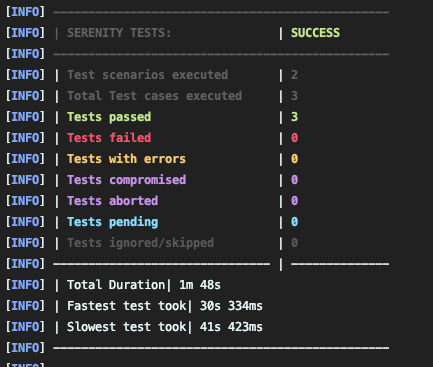
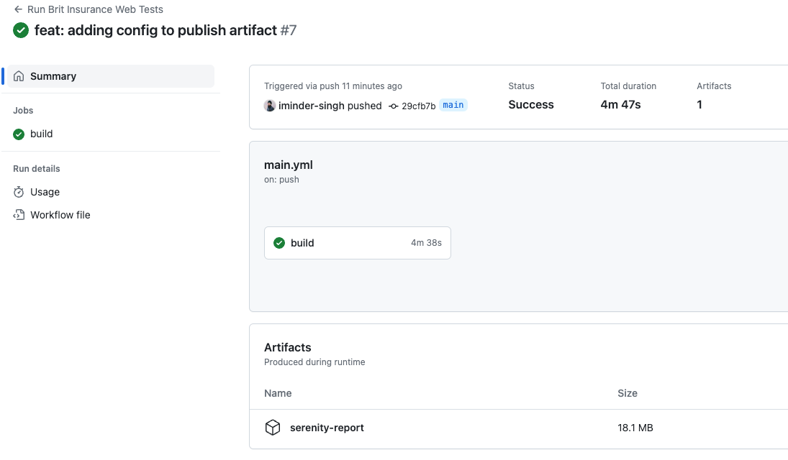

# Brit Insurance Web Tests

Web tests for Brit Insurance website: [https://www.britinsurance.com](https://www.britinsurance.com/)

[](https://github.com/imindersingh/brit-insurance-web-tests/actions/workflows/main.yml)

## Requirements

- Java 11
- Maven
- Chrome (Tested on v114)

## Project Directory Structure

```
├── README.md
├── pom.xml
└── src
    └── test
        ├── java
        │   └── com
        │       └── britinsurance
        │           └── web
        │               ├── actions
        │               │   ├── NavigateTo.java
        │               │   └── Search.java
        │               ├── components
        │               │   ├── ContactDetails.java
        │               │   ├── HomePage.java
        │               │   ├── Menu.java
        │               │   ├── SearchBar.java
        │               │   └── SearchResults.java
        │               └── features
        │                   ├── TestContactDetails.java
        │                   └── TestSearchingForTerms.java
        └── resources
            ├── data
            │   └── search_results.csv
            ├── logback-test.xml
            └── serenity.conf

```

`actions` - contains classes of modular/reusable actions that can be performed on the site

`components` - contains classes of site components

`features` - contains tests

## Executing Tests

To run all the tests in the terminal:

```
mvn clean verify
```

### Headless

By default, the tests are running in headless. To run without headless, remove `"headless=new"` from `goog:chromeOptions`
in [serenity.conf](src/test/resources/serenity.conf).

## Framework

### Choice

Given the task, my initial thought was to use Cypress, however after some consideration I decided to
use [Serenity BDD](https://serenity-bdd.github.io/) for the following reasons:

1. Serenity BDD offers a multitude of interfaces which allow for clean, readable tests to be created.
2. The latest version of serenity uses Selenium 4, which
   is [W3C compliant](https://www.lambdatest.com/blog/selenium4-w3c-webdriver-protocol/).
3. Supports parallel execution.
4. Driver management is handled by the framework.

There are some downsides to Serenity BDD too:

1. It can be quite confusing getting to grips with Serenity as it offers several implementations to do one thing.
2. The built-in reporting, although very rich in detail, can become very large.
3. Requires maintenance. Constantly evolving framework, which sometimes can result in changes when upgrading versions.

Overall, I decided to Serenity because of its flexibility and ability to create tests relatively quickly.

### Design

For the design, I decided:

1. Not to implement BDD/Cucumber. Given the task, this would have added a layer of abstraction which would have been
   unnecessary. However, if the requirement of BDD was there, and if BDD is used the correct way within an organisation, it makes sense to drive tests
   through plain text.
2. To use JUnit with the screenplay pattern. This allowed me to create readable, user-centric tests fast.

#### Screenplay pattern

1. The framework is structured in a way that focuses on web [components](src/test/java/com/britinsurance/web/components)
   and [actions](src/test/java/com/britinsurance/web/actions) that can be performed in the application over the traditional page-object
   model.
2. Along with this, the screenplay pattern has the concept of questions, which is a way to inspect the state and
   retrieve information required.
3. The Screenplay pattern allows user-focused, end-to-end web tests to be written fluently, driven by the concept of actors.

More information about the screenplay pattern can be
found [here](https://serenity-bdd.github.io/docs/screenplay/screenplay_fundamentals).

## High Level Approach

1. My approach before creating any tests was to go through the scenarios and understand the journeys. Whilst doing this I
   was able to observe the DOM, components, behaviour on actions and performance to help with the test design.
2. Once I had an understanding of the journeys and test requirements, I began by creating the components and actions
   required for the tests.
3. This was followed by understanding the inputs, expected and actual test results and devising the data required.
4. In the final step, I created the tests using the components and actions along with the test data, and debugged until I saw the tests passing.
5. Following the tests, I refactored and cleaned up the tests and classes, and also added some enhancements.

## Observations

One key observation was the time taken for the search bar to appear before it could be interacted with, which was
causing tests to fail intermittently.

When I looked at the DOM, it was taking around 9-10 seconds for the home page to fully load. This was slower with
ChromeDriver.

Serenity has a lot of in-built waiting capabilities which have a default time of 5 seconds, so I initially increased
these
through `webdriver.wait.for.timeout` and `webdriver.capabilities.timeouts.implicit`
in [serenity.conf](src/test/resources/serenity.conf).

I saw an increase in stability of the tests but still saw failures, so I added some more granular control
in [Search.java](src/test/java/com/britinsurance/web/actions/Search.java) to increase the wait time for the search input to be present.

## Results

Terminal execution output:



### GitHub Serenity Report

The serenity report is being published as part of the build. For example,
on [this](https://github.com/imindersingh/brit-insurance-web-tests/actions/runs/5457454000) run, the `serenity-report` is published
as an artifact:



### Viewing Report

1. Click `serenity-report` and download the artifact
2. Unzip the folder
3. Open `index.html` in your browser to view the report

The report includes a breakdown of the steps and screenshots after each step showing the interactions.

## Enhancements

1. I've added parametrization to [TestSearchingForTerms](src/test/java/com/britinsurance/web/features/TestSearchingForTerms.java), so the test is
   driven by data from [search_results.csv](src/test/resources/data/search_results.csv).
2. I've added CI through GitHub actions to build and run the tests.
   See [main](https://github.com/imindersingh/brit-insurance-web-tests/actions/workflows/main.yml) workflow.
    1. The build can be manually triggered from `Run workflow`:

       

## Improvements

- It takes a while for the report to be published on GitHub, so another option would be to upload a single page summary report available in Serenity.
- `serenity.conf` can be configured with multiple configurations for different environments and OS for tests to be run across multiple
  browser/platforms.
- I've tried to use `data-*` selectors where available. From an application perspective, to increase testability and
  stability, `data-*` attributes should be added. Other selectors such as CSS can change if there are development changes,
  or if the application uses dynamic IDs.
- Given this is a tech test, changes have been going into a single branch. The main branch should be protected and changes should be added through the
  adopted branching strategy.
- With the tests parameterized, the second iteration of `testSearchingForTerms_ReturnsCorrectResults` fails on the odd occasion on the GitHub runner,
  however consistently passes locally. So there is some difference in the environment and setup. It could be a concurrency issue or ChromeDriver
  related. Given the time I would investigate this issue to stablise the tests running on GitHub runners.
