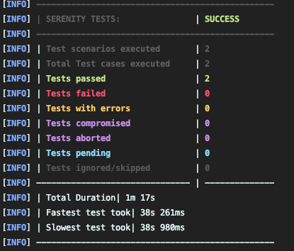

# Brit Insurance Web Tests

Web tests for Brit Insurance website

## Requirements

- Java 11
- Maven
- Chrome

### The project directory structure

```
src
└── src
└── test
├── java
│   └── com
│       └── britinsurance
│           └── web
│               ├── actions                
│               ├── components 
│               └── features
└── resources
└── data
```

`actions` - contain classes of modular/reusable actions that can be performed on the site
`components` - contain web component classes of page components
`features` - contain tests

## Executing the tests

To run all the tests

```
mvn clean verify
```

## Framework

### Choice

Give the task, my initial thought was to use Cypress, however after some consideration I decided to
use [Serenity BDD](https://serenity-bdd.github.io/) for the following reasons:

1. Serenity BDD offers a multitude of interfaces which allow for clean, readable tests to be created
2. The latest version of serenity uses Selenium 4, which
   is [W3C compliant](https://www.lambdatest.com/blog/selenium4-w3c-webdriver-protocol/). Other web frameworks
3. Supports parallel execution
4. WebDriver management is handled by the framework

There are some downsides to Serenity BDD too:

1. It can be quite confusing getting to grips with Serenity as it offers several implementations to do one thing
2. The built-in reporting, although very rich can become very large
3. Constantly evolving framework, which sometimes can result in changes when upgrading versions

### Design

For the design, I decided:

1. Not to not implement BDD/Cucumber. Given the task, this would have added a layer of abstraction which would have been
   unnecessary
2. To use junit with the screenplay pattern. This allowed me to create readable, user-centric tests pretty quickly

#### Screenplay pattern

1. The framework is structured in a way that focuses on web [components](src/test/java/com/britinsurance/web/components)
   and [actions](src/test/java/com/britinsurance/web/actions) that can be performed over the traditional page-object
   model.
2. Along with this, the screenplay pattern has the concept of questions, which is a way to inspect the state and
   retrieve
   information required.
3. The Screenplay pattern allows user-focused, end-to-end web tests to be written fluently.

More information about the screenplay pattern can be
found [here](https://serenity-bdd.github.io/docs/screenplay/screenplay_fundamentals).

## Approach

1. My approach before creating any tests was to go through the scenarios and understand the journey. Whilst doing this I
   was able to observe the DOM, components, behaviour on actions and performance to help with the test design.
2. Once I had an understanding of the journeys and test requirements, I began by creating the components and actions
   required for the tests.
3. This was followed by understanding the inputs, expected and actual test results and devising the data required.
4. In the final step I created the tests using the components and actions along with the test data, and iterated through
   the steps until I saw the tests passing.
5. Following the tests, I refactored and cleaned up the tests and classes.

## Observations

One key observation was the time taken for the search bar to appear before it could be interacted with, which was
causing tests to fail intermittently.

I looked at the DOM and it was taking around 9-10 seconds for it to fully load. This was slower through the
ChromeDriver.

Serenity has a lot of inbuilt waiting capabilities which have a default time of 5 seconds, so I initially increased
these
through `webdriver.wait.for.timeout` and `webdriver.capabilities.timeouts.implicit`
in [serenity.conf](src/test/resources/serenity.conf).

I saw an increase in stability of the tests but still saw failures so I added some more granular control
in [Search.java](src/test/java/com/britinsurance/web/actions/Search.java) to wait for the search field appear before
trying to send keys.

## Results


Github actions

## Improvements
- The input and output data can be read from data files, and the tests can be parameterized for testing different cases
- Multiple OS environment configuration
